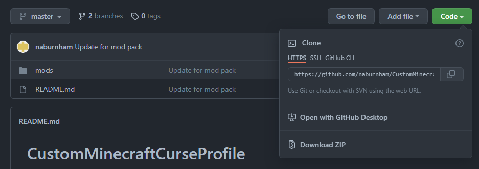

# CustomMinecraftProfile

## Version Notes
Minecraft Version: 1.14.4
Forge Version: 28.2.23

## Installation Steps through CurseForge Launcher

1. Open Curseforge and create custom profile

2. Enter a profile name, ensure Minecraft version is set to 1.14.4 and Forge version is set to 28.2.23

3. After the profile is generated, right click and select Open Folder. Navigate to the mods folder. Keep open for step 5.

4. Above this README, select Code dropdown menu, then select download zip

5. Extract files from the Downloaded Github File, then navigate to the mods folder. Copy all mods over to the Curseforge mods folder.

6. Hit play on CurseForge launcher.